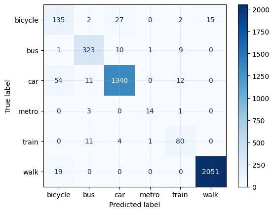

  
  <strong style="font-size: 22px;">MeowMotion: Detecting Trips and Transport Mode from GPS Data</strong> 
  <strong>Developer & Author:</strong> Dr. Faraz M. Awan

 

# Introduction

Understanding travel behavior is crucial for urban planning, transport modeling, and policy-making. This project focuses on **Travel Mode Detection** using **Mobile Phone App GPS data** from **Huq Industries**, with a specific application to **Glasgow City**. The goal is to infer the modes of transport used by individuals based on their movement patterns and geospatial characteristics. The workflow involves multiple key steps:

1. **Detecting Stop Nodes** – Identifying locations where users remain stationary for a significant duration.
2. **Forming Trips** – Constructing trips by linking detected stop nodes and analyzing movement sequences.
3. **Training a Machine Learning Model** – Using **secondary travel diary data** from **TravelAI**, various mobility and geospatial features were engineered to train a model capable of distinguishing different transport modes.
4. **Applying the Model** – The trained model was applied to the trips derived from **mobile phone GPS data** to classify the mode of travel.
5. **Manual Validation** – To ensure accuracy, a subset of classified trips was manually reviewed and validated.

This methodology leverages **machine learning, mobility analysis, and geospatial data processing** to provide an automated and scalable approach to travel mode detection. The insights derived from this work can support **transport planning, infrastructure development, and sustainable mobility initiatives** within Glasgow City.

**Note:** To understand **Stop Node Detection** and **Trip Formation** in greater detail, please request the documentation for **OD Matrices** from **UBDC's data service** (ubdc-dataservice@glasgow.ac.uk), as this is a separate data product.

## Methodology

The travel mode detection process is based on machine learning and consists of several key steps. This methodology describes the approach taken to detect, classify, and validate travel modes using **mobile phone GPS data from Huq Industries** and **secondary travel diary data from TravelAI**.

### 1. Data Collection & Preprocessing

The raw dataset used in this study comes from **Huq Industries**, which collects anonymized **GPS data from mobile phone applications**. This data includes latitude, longitude, timestamp, and other mobility-related attributes. Since raw GPS data often contains inconsistencies, noise, and missing values, several preprocessing steps were performed:

- **Filtering GPS Points**:
  - Removed outlier points with unrealistic speeds or jumps in location that suggest GPS drift or data collection errors.
  - Applied **spatial and temporal smoothing techniques** to remove noise in movement patterns.

- **Detecting Stop Nodes & Forming Trips**:
  - **Stop Nodes** were identified based on dwell times, where a user remained within a small spatial radius for a significant period.
  - Trips were formed by linking **consecutive stop nodes** and analyzing movement segments between them.

- **Matching GPS Data with TravelAI Diary Data**:
  - TravelAI provided **travel diary data**, which includes labeled trip modes from surveyed participants.
  - This data was used to create a **ground truth dataset** for training and validating machine learning models.
  - GPS records were matched to corresponding diary entries based on **timestamps and spatial proximity**.

### 2. Feature Engineering

Once trips were identified, several features were engineered to describe the movement patterns of each trip. These features were crucial for distinguishing between different travel modes (e.g., walking, cycling, car, train, bus).

- **Speed and Acceleration Features**:
  - **Mean and maximum speed**: Faster speeds are indicative of vehicular modes like cars or trains.
  - **Acceleration variance**: A higher variance is often seen in cars and bikes compared to walking.

- **Trip Characteristics**:
  - **Trip duration**: Longer trips may indicate public transport usage.
  - **Distance traveled**: Short trips are more likely to be walking or cycling.

- **Geospatial Context**:
  - **Proximity to transport hubs**: Trips starting or ending near train stations may be train journeys.
  - **Road Type Information**: Matching GPS data with OpenStreetMap (OSM) data to determine whether a trip follows pedestrian pathways, highways, or railway tracks.

### 3. Model Training & Validation

To classify trips into different travel modes, machine learning models were trained using labeled TravelAI data. The following steps were performed:

- **Data Splitting**: The dataset was split into **training (80%) and testing (20%)** sets to evaluate model performance.
- **Handling Class Imbalance**: Since certain transport modes (e.g., trains) occur less frequently in the data, **Synthetic Minority Over-sampling Technique (SMOTE)** was applied to balance the dataset.
- **Model Selection & Training**:
  - **Random Forest Classifier** was selected due to its ability to handle non-linear relationships and robustness to noisy data.
  - **Hyperparameter tuning** was performed using **GridSearchCV** to optimize performance.

- **Model Evaluation**:
  - **Accuracy, Precision, anf Recall** were used to assess model performance.
  - **Confusion Matrices** were generated to analyze misclassifications.
  - **Cross-validation** ensured that the model was not overfitting to specific data samples.

## Model Performance: Random Forest Classifier

The **Random Forest** classifier was used to predict travel modes based on extracted mobility and geospatial features. Below is the **confusion matrix**, which illustrates the model's performance in classifying different transport modes.

### Confusion Matrix
The confusion matrix visually represents the number of correctly and incorrectly classified trips for each transport mode.

### Classification Performance

The table below summarizes the **Precision, Recall, and Accuracy** for each travel mode:

| Travel Mode | Precision (%) | Recall (%) |
|------------|--------------|------------|
| **Walking**   | 99.27        | 99.08      |
| **Cycling**   | 64.59        | 74.59      |
| **Bus**       | 92.29        | 93.90      |
| **Car**       | 97.03        | 94.57      |
| **Metro**     | 87.50        | 77.78      |
| **Train**     | 76.92        | 83.33      |

### Overall Model Accuracy
- **Accuracy:** **95.56%**
This indicates that the model correctly classifies travel modes in **95.56%** of the cases, demonstrating strong predictive performance.

The results show that **high-precision** and **high-recall** values are achieved for **walking, bus, and car** modes, while **cycling, metro, and train** exhibit relatively lower recall due to potential overlaps in travel behavior patterns.

These insights can help in improving urban mobility analysis and transport policy-making for Glasgow City.

### 4. Applying the Model

After training, the model was deployed to classify the travel modes for trips detected from mobile phone GPS data. The classification was performed as follows:

- The trained model was applied to unseen trip data to predict travel modes.
- Each trip was classified into **one of the predefined transport categories** (e.g., walking, cycling, bus, car, train).
- Mode transition probabilities were considered to refine predictions (e.g., it is unlikely for a person to switch from walking to a train within a few seconds).

### 5. Manual Validation & Quality Assessment

To ensure the reliability of the predicted travel modes, **manual validation** was conducted on a subset of the classified trips:

- **Comparison with Known TravelAI Labels**: The model’s predictions were cross-checked against labeled trips from the TravelAI dataset.
- **Statistical Analysis**:
  - Distribution of predicted transport modes was compared with known travel behavior patterns in Glasgow.
  - **Mode share comparisons** ensured that the predictions aligned with expected usage of different transport modes.
- **Error Analysis**:
  - Misclassified trips were analyzed to identify common issues, such as misclassification of slow-moving cars as cycling.
  - Adjustments were made to improve classification rules where necessary.

### Summary

This methodology provides a **structured and automated framework** for detecting travel modes using machine learning and GPS mobility data. By leveraging **geospatial analysis, mobility characteristics, and machine learning classification**, this approach can be used for large-scale travel behavior analysis to support **urban planning, transportation modeling, and policy-making** in Glasgow City.
