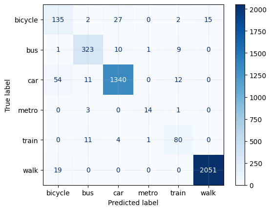

    
    Travel Mode Detection
    
     
     <strong> Prepared by: </strong>  Dr. Faraz M. Awan 

- [1. Introduction](#1-introduction)
- [2. Methodology](#2-methodology)
    - [1. Datasets](#1-datasets)
    - [2. Feature Engineering](#2-feature-engineering)
    - [4. Final Training Data (Meta Data)](#4-final-training-data-meta-data)
    - [4. Model Training \& Validation](#4-model-training--validation)
- [3. Model Performance: Random Forest Classifier](#3-model-performance-random-forest-classifier)
    - [1. Confusion Matrix](#1-confusion-matrix)
    - [2. Classification Performance](#2-classification-performance)
    - [3. Overall Model Accuracy](#3-overall-model-accuracy)
- [4. Applying the Model](#4-applying-the-model)
- [5. Manual Validation \& Quality Assessment](#5-manual-validation--quality-assessment)
  - [5.1. Data Bias](#51-data-bias)
- [6. Summary](#6-summary)

# 1. Introduction

Understanding travel behavior is crucial for urban planning, transport modeling, and policy-making. This project focuses on **Travel Mode Detection** using **Mobile Phone App GPS data** from **Huq Industries**, with a specific application to **Glasgow City**. The goal is to infer the modes of transport used by individuals based on their movement patterns and geospatial characteristics. The workflow involves multiple key steps:

1. **Detecting Stop Nodes** – Identifying locations where users remain stationary for a significant duration.
2. **Forming Trips** – Constructing trips by linking detected stop nodes and analyzing movement sequences.
3. **Training a Machine Learning Model** – Using **secondary travel diary data** from **TravelAI**, various mobility and geospatial features were engineered to train a model capable of distinguishing different transport modes.
4. **Applying the Model** – The trained model was applied to the trips derived from **mobile phone GPS data** to classify the mode of travel.
5. **Manual Validation** – To ensure accuracy, a subset of classified trips was manually reviewed and validated.

This methodology leverages **machine learning, mobility analysis, and geospatial data processing** to provide an automated and scalable approach to travel mode detection. The insights derived from this work can support **transport planning, infrastructure development, and sustainable mobility initiatives** within Glasgow City.

**Note:** To understand **Stop Node Detection** and **Trip Formation** in greater detail, please request the documentation for **OD Matrices** from **UBDC's data service** (ubdc-dataservice@glasgow.ac.uk), as this is a separate data product.

# 2. Methodology

The travel mode detection process is based on machine learning and consists of several key steps. This methodology describes the approach taken to detect, classify, and validate travel modes using **mobile phone GPS data from Huq Industries** and **secondary travel diary data from TravelAI**.

### 1. Datasets
 <u>**Mobile Phone App Data from Huq Industries (Primary Data)**</u>

 The raw dataset used in this study comes from **Huq Industries**, which collects anonymized **GPS data from mobile phone applications**. This data includes latitude, longitude, timestamp, and other mobility-related attributes. Since raw GPS data often contains inconsistencies, noise, and missing values, several preprocessing steps were performed:

- **Filtering GPS Points**:
  - Removed outlier points with unrealistic speeds or jumps in location that suggest GPS drift or data collection errors.
  - Applied **spatial and temporal smoothing techniques** to remove noise in movement patterns.

- **Detecting Stop Nodes & Forming Trips**:
  - **Stop Nodes** were identified based on dwell times, where a user remained within a small spatial radius for a significant period.
  - Trips were formed by linking **consecutive stop nodes** and analyzing movement segments between them.

**Processed Trip Data from Primary Mobile Phone App (MPA) Data Attributes**
| Attribute          | Description |
|--------------------|-------------|
| `uid`             | Unique identifier for the user or device. |
| `org_lat`         | Latitude coordinate of the trip's origin. |
| `org_lng`         | Longitude coordinate of the trip's origin. |
| `org_arrival_time` | Timestamp when the user arrived at the origin. |
| `org_leaving_time` | Timestamp when the user left the origin. |
| `dest_lat`        | Latitude coordinate of the trip's destination. |
| `dest_lng`        | Longitude coordinate of the trip's destination. |
| `dest_arrival_time` | Timestamp when the user arrived at the destination. |
| `trip_points`     | Number of recorded data points along the trip. |
| `trip_time`       | Total duration of the trip. |

This dataset provides detailed insights into user mobility, enabling analysis of travel patterns and stay behavior for **travel mode detection**. This dataset was used as input for applying the trained **travel mode detection model**, enabling the classification of transportation modes based on smartphone sensor and location data.

 <u>**Travel Diary Data from TravelAi (Training Data)**</u>

 The **TravelAI travel diary dataset** is a mobility dataset collected through smartphone applications, designed to capture real-world travel behavior. It leverages a combination of **GPS, accelerometer, gyroscope, and other smartphone sensor data** to infer transportation modes such as walking, cycling, driving, or using public transit. The dataset is generated through active participation, where users record their trips, providing ground truth labels for mode detection.

This dataset is widely used in **transportation research, mobility analytics, and smart city applications**, allowing data-driven insights into travel behavior, route preferences, and multimodal transport patterns. For machine learning applications, TravelAI data serves as a benchmark for **training and validating models** that detect and classify travel modes from raw smartphone sensor readings.

For this project, the TravelAI dataset was used to train a machine learning model for **automated travel mode detection**, enabling accurate identification of transport modes based on real-world mobility patterns.

| Attribute         | Description |
|------------------|-------------|
| `installation_id` | Unique identifier for the app installation on a user's device. |
| `segment_id`     | Identifier for a specific segment of a trip. |
| `trip_id`        | Unique identifier for a complete trip taken by a user. |
| `leg_id`         | Identifier for a specific leg of a trip, representing a continuous travel mode. |
| `point_id`       | Sequential ID for individual data points within a trip leg. |
| `transport_mode` | The mode of transportation detected or labeled (e.g., walking, cycling, driving, public transit). |
| `ping_date`      | Date when the GPS data was recorded. |
| `ping_time`      | Time when the GPS data was recorded. |
| `latitude`       | Latitude coordinate of the recorded location. |
| `longitude`      | Longitude coordinate of the recorded location. |
| `start_time`     | Start time of the trip leg. |
| `end_time`       | End time of the trip leg. |

This dataset serves as the foundation for developing and evaluating **travel mode detection models**, enhancing mobility analysis and intelligent transport systems.

### 2. Feature Engineering

For both of the datasets, MPA Huq data as well as TravelAi data, several features were engineered to describe the movement patterns of each trip. These features were crucial for distinguishing between different travel modes (e.g., walking, cycling, car, train, bus).

- **Speed and Acceleration Features**:
  - **Mean and maximum speed**: Faster speeds are indicative of vehicular modes like cars or trains.
  - **Acceleration variance**: A higher variance is often seen in cars and bikes compared to walking.

- **Trip Characteristics**:
  - **Trip duration**: Longer trips may indicate public transport usage.
  - **Distance traveled**: Short trips are more likely to be walking or cycling.

- **Geospatial Context**:
  - **Proximity to transport hubs**: Trips starting or ending near train stations may be train journeys.
  - **Road Type Information**: Matching GPS data with OpenStreetMap (OSM) data to determine whether a trip follows pedestrian pathways, highways, or railway tracks.
### 4. Final Training Data (Meta Data)

 *Note: Attributes marked with* "*" *are the important attributes, which were used to trian Machine Learning Model* 

| **Attributes**         | **Description**                                                                                                                                                                                                                                                                   |
|------------------------|-----------------------------------------------------------------------------------------------------------------------------------------------------------------------------------------------------------------------------------------------------------------------------------|
| installation_id        | Unique user ID.                                                                                                                                                                                                                                                                   |
| trip_id                | Unique trip id of the user.                                                                                                                                                                                                                                                       |
| timestamp              | Timestamp when ping was received.                                                                                                                                                                                                                                                 |
| latitude and longitude | Coordinates of the place where ping was detected.                                                                                                                                                                                                                                 |
| transport_mode*        | The transport mode used (walk, bicycle, car, bus,train etc.).                                                                                                                                                                                                                     |
| num_of_impressions     | Number of impressions in each trip.                                                                                                                                                                                                                                               |
| time_taken             | Time taken to move from one point to the next in a given leg of the trip.                                                                                                                                                                                                         |
| prev_lat and prev lon  | Coordinates of the previous point with respect to the current points. They were introduced to compute some attributes such as speed and acceleration.                                                                                                                             |
| distance_covered*      | Distance covered from one point to next.                                                                                                                                                                                                                                          |
| speed                  | Speed with which the distance was covered.                                                                                                                                                                                                                                        |
| speed_z_score          | Z-score values of the speed in a trip. They were calculated to identify the outlier speed values.                                                                                                                                                                                 |
| new_speed*             | Outlier-removed speed values.                                                                                                                                                                                                                                                     |
| acceleration*          | Acceleration between one point to the next.                                                                                                                                                                                                                                       |
| jerk*                  | Rate of change of acceleration.                                                                                                                                                                                                                                                   |
| bearing*               | Direction of one point in relation to the next.                                                                                                                                                                                                                                   |
| angular_deviation*     |  Difference between measures and expected direction.                                                                                                                                                                                                                              |
| month*                 | Month value when the trip point was detected.                                                                                                                                                                                                                                     |
| hour*                  | Hour value when the trip point was detected.                                                                                                                                                                                                                                      |
| is_weekend*            | Flag variable showing if the trip was made on weekend.                                                                                                                                                                                                                            |
| hour_category*         | Hour category refers the 4 categories of the time; 0) Night, 1) Morning, 2) Afternoon,  and 3) Evening.                                                                                                                                                                           |
| geometry               | Lat lon presented as geometry.                                                                                                                                                                                                                                                    |
| trip-group             | Incremental numeric value assigned to each point of the trips. For example, trip_group value of all the points of first trip in the csv file will be "1".                                                                                                                         |
| stat_end_at_bus_stop*  | Flag variable stating if the start and/or end point of the trip are near bus stop. It contains 3 possible values: 0) none of the points were found near any bus stops, 1) one of the points  were found near any bus stops, and 2) both of the points were found near a bus stop. |
| straightness_index*    | Value between 0 and 1, stating how straight the trip trajectory was. 1 represents the straight line trip.                                                                                                                                                                         |

### 4. Model Training & Validation

To classify trips into different travel modes, machine learning models were trained using labeled TravelAI data. The following steps were performed:

- **Data Splitting**: The dataset was split into **training (80%) and testing (20%)** sets to evaluate model performance.
- **Handling Class Imbalance**: Since certain transport modes (e.g., trains) occur less frequently in the data, **Synthetic Minority Over-sampling Technique (SMOTE)** was applied to balance the dataset.
- **Model Selection & Training**:
  - **Random Forest Classifier** was selected due to its ability to handle non-linear relationships and robustness to noisy data.
  - **Hyperparameter tuning** was performed using **GridSearchCV** to optimize performance.

- **Model Evaluation**:
  - **Accuracy, Precision, anf Recall** were used to assess model performance.
  - **Confusion Matrices** were generated to analyze misclassifications.
  - **Cross-validation** ensured that the model was not overfitting to specific data samples.

# 3. Model Performance: Random Forest Classifier

The **Random Forest** classifier was used to predict travel modes based on extracted mobility and geospatial features. Below is the **confusion matrix**, which illustrates the model's performance in classifying different transport modes.

### 1. Confusion Matrix
The confusion matrix visually represents the number of correctly and incorrectly classified trips for each transport mode.

### 2. Classification Performance

The table below summarizes the **Precision, Recall, and Accuracy** for each travel mode:

| Travel Mode | Precision (%) | Recall (%) |
|------------|--------------|------------|
| **Walking**   | 99.27        | 99.08      |
| **Cycling**   | 64.59        | 74.59      |
| **Bus**       | 92.29        | 93.90      |
| **Car**       | 97.03        | 94.57      |
| **Metro**     | 87.50        | 77.78      |
| **Train**     | 76.92        | 83.33      |

### 3. Overall Model Accuracy
- **Accuracy:** **95.56%**
This indicates that the model correctly classifies travel modes in **95.56%** of the cases, demonstrating strong predictive performance.

The results show that **high-precision** and **high-recall** values are achieved for **walking, bus, and car** modes, while **cycling, metro, and train** exhibit relatively lower recall due to potential overlaps in travel behavior patterns.

These insights can help in improving urban mobility analysis and transport policy-making for Glasgow City.

# 4. Applying the Model

After training, the model was deployed to classify the travel modes for trips detected from mobile phone GPS data. The classification was performed as follows:

- The trained model was applied to unseen trip data to predict travel modes.
- Each trip was classified into **one of the predefined transport categories** (e.g., walking, cycling, bus, car, train).

# 5. Manual Validation & Quality Assessment

To ensure the reliability of the predicted travel modes, **manual validation** was conducted on a subset of the classified trips:

- **Comparison with Known TravelAI Labels**: The model’s predictions were cross-checked against labeled trips from the TravelAI dataset.
- **Statistical Analysis**:
  - Distribution of predicted transport modes was compared with known travel behavior patterns in Glasgow.
  - **Mode share comparisons** ensured that the predictions aligned with expected usage of different transport modes.
- **Error Analysis**:
  - Misclassified trips were analyzed to identify common issues, such as misclassification of slow-moving cars as cycling.
  - Adjustments were made to improve classification rules where necessary.

## 5.1. Data Bias

The performance of the trained machine learning model relies heavily on the **GPS points** generated during trips. These trip points serve as the foundation for extracting important **mobility and spatial attributes**, which were used to train the model. However, the **Mobile Phone App (MPA) GPS data** sourced from **Huq Industry** is subject to several limitations, including **GPS signal availability** and **GDPR-related data restrictions**.

One critical challenge encountered during model application was that a **significant portion of detected trips from MPA data lacked trip points**. Given that the model requires these trip points for accurate travel mode classification, only those trips that contained trip points were considered for analysis. This filtering step, however, **introduced data bias**.

<u>**Bias Towards Motorized Vehicles:**</u>
 A key observation from the filtered data was that **trips with trip points were predominantly associated with motorized vehicles**. This is likely due to the fact that GPS tracking tends to be more consistent in motorized trips (e.g., cars) compared to non-motorized ones (e.g., walking, cycling), which often suffer from missing data due to **low GPS sampling rates or signal loss in urban areas**.

As a result, the final statistics may **overrepresent motorized trips, particularly car trips**, while underrepresenting other modes of transport. This bias should be taken into account when interpreting the model's results, as it may lead to **an overestimation of car usage and an underestimation of active travel modes like walking and cycling**.

Understanding these biases is crucial for accurately interpreting the model's outputs and ensuring more **equitable mobility insights** across different travel modes.

# 6. Summary

This work presents a **machine learning-based approach** for **travel mode detection** using **Mobile Phone App (MPA) GPS data** from **Huq Industries** and **labeled travel diary data from TravelAI**. The methodology integrates **geospatial analysis, feature engineering, and classification models** to infer travel modes from GPS trajectories.

Key steps in the process include:
- **Preprocessing & Trip Formation**: Stop nodes were detected, and trips were constructed from raw MPA GPS data.
- **Feature Engineering**: Speed, acceleration, spatial context, and trip characteristics were extracted to differentiate travel modes.
- **Model Training & Validation**: A **Random Forest Classifier** was trained on TravelAI data and achieved **95.56% accuracy**, demonstrating strong predictive performance.
- **Application on MPA Data**: The trained model was applied to detected trips, classifying them into predefined transport categories.
- **Bias Considerations**: Due to **data limitations**, the final dataset overrepresented **motorized trips**, particularly car trips, leading to potential bias in mode share analysis.
